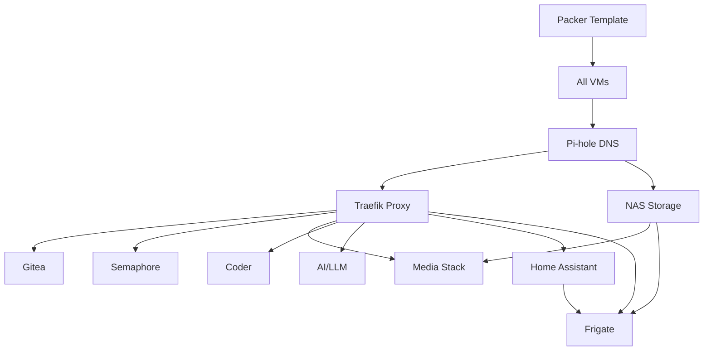

# Service Catalog

This document tracks all services deployed in the home lab, their status, configuration, and dependencies.

**Legend**:
- ✅ Deployed and operational
- 🟡 Partially deployed / testing
- ⚪ Planned, not started
- ❌ Deprecated / removed

---

## Phase 1: Core Automation Pipeline

### Gitea
**Status**: ⚪ Planned
**Type**: LXC Container
**Purpose**: Self-hosted Git repository for all IaC code
**IP**: 192.168.1.212
**URL**: https://git.homelab.local
**Resources**: 1 vCPU, 1 GB RAM, 20 GB disk
**Dependencies**: None
**Config Location**: `ansible/roles/gitea/`
**Notes**: First service to deploy. All code will be migrated here from external Git.

### Semaphore
**Status**: ⚪ Planned
**Type**: VM (Docker)
**Purpose**: Web UI for running Ansible playbooks and Terraform jobs
**IP**: 192.168.1.213
**URL**: https://automation.homelab.local
**Resources**: 2 vCPU, 2 GB RAM, 20 GB disk
**Dependencies**: Gitea (for repository integration)
**Config Location**: `ansible/roles/semaphore/`
**Notes**: Central automation dashboard. Connects to Gitea for repo access.

### Test VM
**Status**: ⚪ Planned
**Type**: VM
**Purpose**: Validation of Packer → Terraform → Ansible workflow
**IP**: 192.168.1.230
**URL**: http://192.168.1.230
**Resources**: 1 vCPU, 1 GB RAM, 10 GB disk
**Dependencies**: None
**Config Location**: `ansible/roles/nginx-test/`
**Notes**: Simple nginx server. Used to verify the full provisioning pipeline. Will be destroyed after Phase 1 validation.

---

## Phase 2: Essential Infrastructure

### Pi-hole + Unbound
**Status**: ⚪ Planned
**Type**: LXC Container
**Purpose**: Network-wide DNS with ad-blocking and recursive DNS resolution
**IP**: 192.168.1.210
**URL**: https://dns.homelab.local/admin
**Resources**: 1 vCPU, 1 GB RAM, 10 GB disk
**Dependencies**: None (but all other services depend on this)
**Config Location**: `ansible/roles/networking/pihole/`
**Upstream DNS**: None (Unbound as recursive resolver)
**Notes**:
- Configure router to use this as primary DNS
- Local DNS records for *.homelab.local
- Critical infrastructure - all services depend on this

### Traefik Reverse Proxy
**Status**: ⚪ Planned
**Type**: VM (Docker)
**Purpose**: HTTPS termination and service routing
**IP**: 192.168.1.211
**URL**: https://proxy.homelab.local/dashboard
**Resources**: 2 vCPU, 2 GB RAM, 20 GB disk
**Dependencies**: Pi-hole (for DNS resolution)
**Config Location**: `ansible/roles/networking/traefik/`
**Exposed Ports**: 80 (HTTP), 443 (HTTPS), 8080 (Dashboard - restricted)
**SSL**: Let's Encrypt for external domains, self-signed for *.homelab.local
**Notes**:
- Entry point for all web services
- Automatic service discovery via Docker labels
- Rate limiting and authentication middleware

### NAS / File Server
**Status**: ⚪ Planned
**Type**: VM
**Purpose**: Central file storage with NFS/SMB shares
**IP**: 192.168.1.220
**URL**: https://nas.homelab.local
**Resources**: 2 vCPU, 4 GB RAM, 500 GB disk
**Dependencies**: Pi-hole
**Config Location**: `ansible/roles/nas/`
**Shares**:
- `/media` - Media files (Jellyfin source)
- `/backups` - VM and service backups
- `/data` - General file storage
**Technology Options**:
- OpenMediaVault (full featured)
- Simple NFS/Samba on Ubuntu (lightweight)
**Notes**: Decision needed on OMV vs simple NFS setup

---

## Phase 3A: Media Stack (Optional Track)

### Media Services VM
**Status**: ⚪ Planned
**Type**: VM (Docker Compose stack)
**Purpose**: Complete media acquisition and streaming pipeline
**IP**: 192.168.1.221
**URL**: Various (routed through proxy)
**Resources**: 4 vCPU, 8 GB RAM, 100 GB disk
**Dependencies**: NAS (for media storage), Pi-hole, Traefik
**Config Location**: `ansible/roles/media_suite/`

**Stack Components**:

#### Gluetun
**Purpose**: VPN container for secure downloading
**URL**: N/A (internal)
**VPN Provider**: TBD (Mullvad, ProtonVPN, etc.)
**Notes**: All download traffic routed through this. Kill-switch enabled.

#### qBittorrent
**Purpose**: Torrent client
**URL**: https://qbit.homelab.local
**Network**: Depends on Gluetun (networked through VPN)
**Notes**: Must verify IP leak protection

#### Prowlarr
**Purpose**: Indexer manager for *arr stack
**URL**: https://prowlarr.homelab.local
**Notes**: Central indexer configuration

#### Sonarr
**Purpose**: TV show management
**URL**: https://sonarr.homelab.local
**Media Path**: /mnt/nas/media/tv

#### Radarr
**Purpose**: Movie management
**URL**: https://radarr.homelab.local
**Media Path**: /mnt/nas/media/movies

#### Jellyfin
**Purpose**: Media streaming server
**URL**: https://jellyfin.homelab.local
**Media Path**: /mnt/nas/media/ (read-only)
**Hardware Acceleration**: TBD (GPU passthrough)
**Notes**: Alternative to Plex, fully open-source

**docker-compose.yml Location**: `ansible/roles/media_suite/files/docker-compose.yml`

---

## Phase 3B: AI & Development (Optional Track)

### Coder
**Status**: ⚪ Planned
**Type**: VM (Docker)
**Purpose**: Remote development environments (VSCode in browser)
**IP**: 192.168.1.232
**URL**: https://code.homelab.local
**Resources**: 2 vCPU, 4 GB RAM, 50 GB disk
**Dependencies**: Pi-hole, Traefik
**Config Location**: `ansible/roles/coder/`
**Notes**:
- Centralized dev environments
- Can spin up workspaces on demand
- Accessible from any device

### AI/LLM Stack
**Status**: ⚪ Planned
**Type**: VM (Docker)
**Purpose**: Local Large Language Model hosting and RAG pipeline
**IP**: 192.168.1.233
**URL**: https://ai.homelab.local
**Resources**: 4 vCPU, 8 GB RAM, 100 GB disk
**GPU**: Requires passthrough of NVIDIA GPU
**Dependencies**: Pi-hole, Traefik
**Config Location**: `ansible/roles/llm_stack/`

**Stack Components**:

#### Ollama
**Purpose**: Local LLM hosting (llama2, mistral, etc.)
**API**: http://localhost:11434
**Models**: TBD (based on GPU VRAM)
**Notes**: Models NOT stored in Git (downloaded on first run)

#### OpenWebUI (Optional)
**Purpose**: Web interface for Ollama
**URL**: https://ai.homelab.local
**Notes**: Alternative to direct API access

#### RAG Pipeline (Custom)
**Purpose**: Index Obsidian vault for retrieval-augmented generation
**Technology**: Python + LangChain + FAISS/ChromaDB
**Source**: Obsidian vault (synced via Git or Nextcloud)
**Notes**:
- Indexes markdown files into vector DB
- Provides context-aware answers from personal notes
- API endpoint for queries

---

## Phase 3C: Home Automation (Optional Track)

### Home Assistant
**Status**: ⚪ Planned
**Type**: VM (HAOS)
**Purpose**: Smart home automation and device integration
**IP**: 192.168.1.240
**URL**: https://ha.homelab.local
**Resources**: 2 vCPU, 4 GB RAM, 32 GB disk
**Dependencies**: Pi-hole, Traefik
**Config Location**: `terraform/vms/vm-home-assistant.tf`
**Notes**:
- Use official Home Assistant OS VM image
- May require separate VLAN for IoT devices
- Configuration in YAML (can be Git-backed)

### Frigate NVR
**Status**: ⚪ Planned
**Type**: VM (Docker)
**Purpose**: Network Video Recorder with AI object detection
**IP**: 192.168.1.241
**URL**: https://frigate.homelab.local
**Resources**: 4 vCPU, 6 GB RAM, 50 GB disk
**Hardware**: Coral TPU (USB passthrough) strongly recommended
**Storage**: Recordings on NAS (/mnt/nas/cctv)
**Dependencies**: NAS, Home Assistant (for integration)
**Config Location**: `ansible/roles/frigate/`
**Cameras**: TBD (RTSP streams)
**Notes**:
- CPU-intensive without Coral TPU
- Integrates with Home Assistant
- Motion detection, person/vehicle recognition

---

## Phase 4: Additional Services (Future)

### Nextcloud
**Status**: ⚪ Planned
**Purpose**: Cloud storage and collaboration
**URL**: https://cloud.homelab.local
**Resources**: 2 vCPU, 4 GB RAM, 100 GB disk
**Notes**: Dropbox/Google Drive replacement

### Monitoring Stack
**Status**: ⚪ Planned
**Purpose**: System and service monitoring
**Stack**: Prometheus + Grafana + Loki
**URL**: https://monitoring.homelab.local

### Dashboard
**Status**: ⚪ Planned
**Purpose**: Central dashboard for all services
**Options**: Homarr, Flame, Heimdall
**URL**: https://home.homelab.local

### n8n / Node-RED
**Status**: ⚪ Planned
**Purpose**: Workflow automation and integrations
**URL**: https://workflows.homelab.local
**Use Cases**: Email parsing, Discord bots, cross-service automation

### Uptime Kuma
**Status**: ⚪ Planned
**Purpose**: Service uptime monitoring
**URL**: https://uptime.homelab.local

---

## Service Dependencies

---

## Port Registry

| Service | Internal Port | Exposed Via | External URL |
|---------|---------------|-------------|--------------|
| Pi-hole Admin | 80 | Traefik | https://dns.homelab.local/admin |
| Pi-hole DNS | 53 | Direct | N/A |
| Traefik Dashboard | 8080 | Traefik (auth) | https://proxy.homelab.local/dashboard |
| Traefik HTTP | 80 | Direct | N/A (redirect to HTTPS) |
| Traefik HTTPS | 443 | Direct | N/A (entry point) |
| Gitea | 3000 | Traefik | https://git.homelab.local |
| Semaphore | 3000 | Traefik | https://automation.homelab.local |
| Jellyfin | 8096 | Traefik | https://jellyfin.homelab.local |
| Sonarr | 8989 | Traefik | https://sonarr.homelab.local |
| Radarr | 7878 | Traefik | https://radarr.homelab.local |
| Prowlarr | 9696 | Traefik | https://prowlarr.homelab.local |
| qBittorrent | 8080 | Traefik | https://qbit.homelab.local |
| Home Assistant | 8123 | Traefik | https://ha.homelab.local |
| Frigate | 5000 | Traefik | https://frigate.homelab.local |
| Ollama | 11434 | Internal | N/A (API only) |
| Coder | 7080 | Traefik | https://code.homelab.local |

---

## Deployment Checklist

### Phase 1 Completion
- [ ] Packer template built successfully
- [ ] Gitea deployed and accessible
- [ ] Semaphore deployed and connected to Gitea
- [ ] Test VM provisioned via Terraform
- [ ] Test VM configured via Ansible (through Semaphore)
- [ ] Full destroy/recreate cycle validated
- [ ] All code committed to self-hosted Gitea

### Phase 2 Completion
- [ ] Pi-hole deployed and set as router DNS
- [ ] Unbound configured as recursive resolver
- [ ] All services resolve via internal DNS
- [ ] Traefik deployed with HTTPS enabled
- [ ] Let's Encrypt or self-signed CA configured
- [ ] NAS deployed with shares accessible
- [ ] All Phase 1 services migrated behind proxy

### Phase 3 Completion (Choose One Track)
- [ ] **Track A**: Media stack fully operational and tested
- [ ] **Track B**: Dev environments and AI/LLM accessible
- [ ] **Track C**: Home automation and cameras integrated

---

**Last Updated**: 2025-11-14
**Next Review**: After each phase completion
